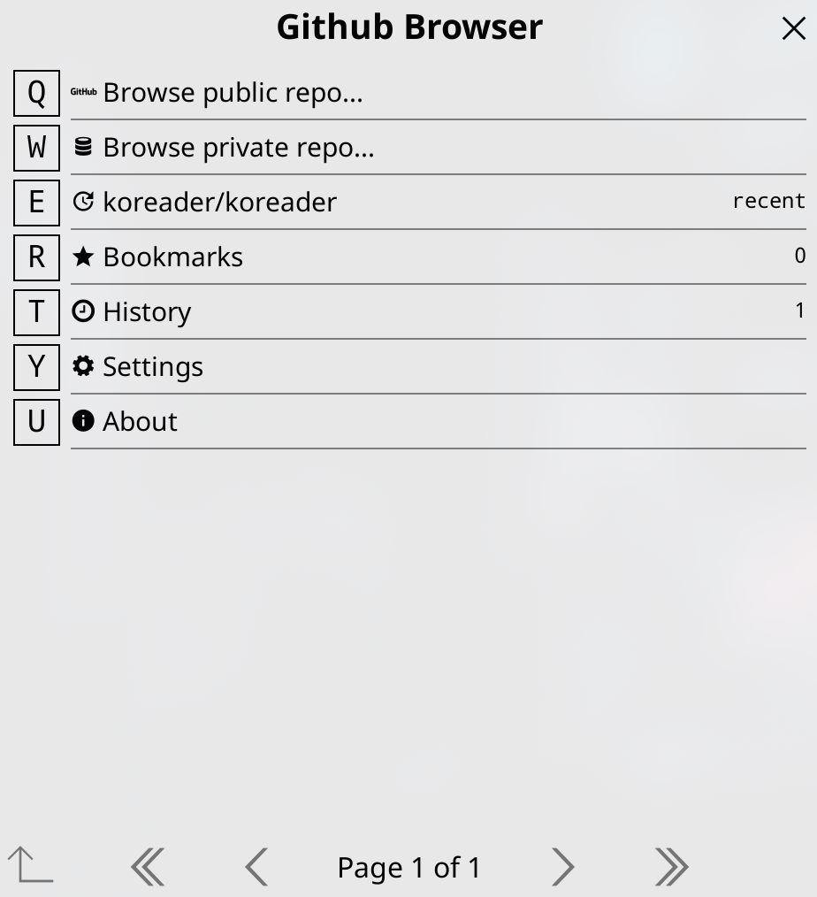
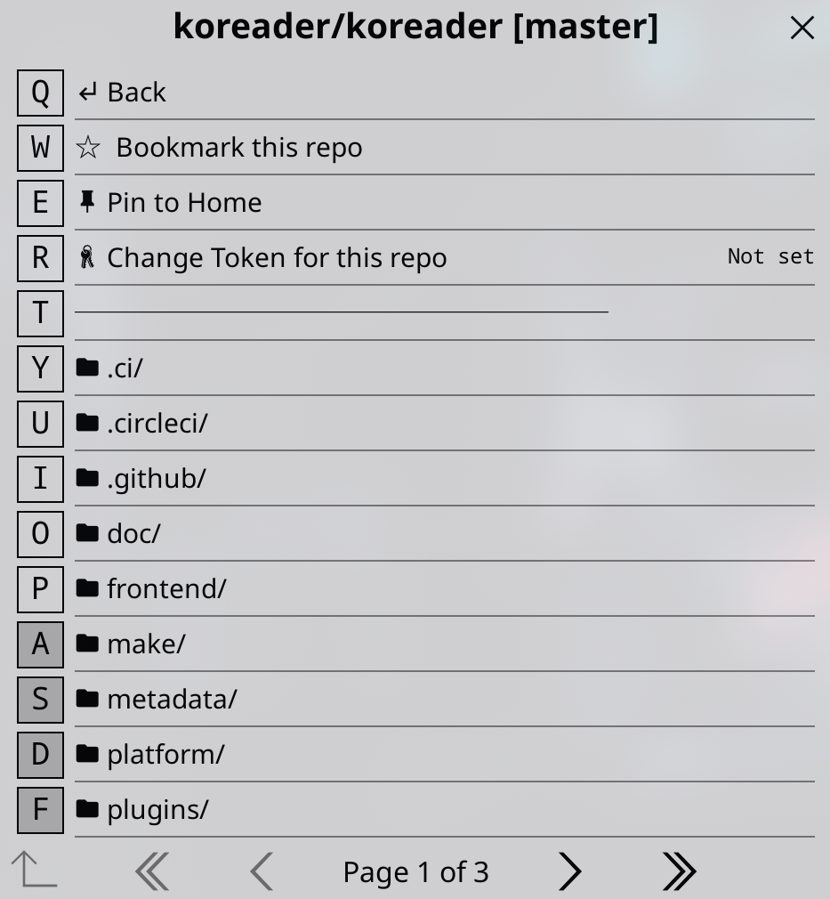

# Github Browser Plugin for KOReader
| Home Screen | Repository Browser |
|:-------------------------:|:-------------------------:|
|  |  |

A plugin for KOReader that lets you browse GitHub repositories, view code, and download files — all directly from your e-reader.

## ✨ Features
- **🔓 Public Repos**: Browse any public GitHub repository without authentication.
- **🔐 Private Repos**: Access private repositories using GitHub Personal Access Tokens.
- **📂 File Browser**: Navigate directories, view text/code files, and download documents.
- **✏️ Edit & Commit**: Edit files and commit changes directly from your device.
- **🔑 Multi-Token**: Manage multiple GitHub tokens, set defaults, and assign per-repo tokens.
- **📌 Pin & Bookmark**: Pin frequently used repos to the home screen and bookmark favorites.
- **📜 History**: Track recently visited repositories with configurable history limits.
- **🎯 Gesture Support**: Assign a gesture shortcut to launch the plugin instantly.

## 🛠️ Installation

1. Copy the `githubbrowser.koplugin` folder to your KOReader `plugins/` directory:
   - **Kobo**: `/mnt/onboard/.adds/koreader/plugins/`
   - **Kindle**: `/mnt/us/koreader/plugins/`
   - **Android**: Wherever your KOReader data directory is located.
   - **Desktop (AppImage)**: `~/.config/koreader/plugins/`
2. Restart KOReader.
3. The plugin will appear in the **Search** menu (4th column in the top menu).

## 📱 Usage Guide

### Getting Started
Open the plugin from the KOReader top menu under **Search > Github Browser**:
1. **Browse public repo...**: Enter `owner/repo` or a full GitHub URL to browse any public repository.
2. **Browse private repo...**: Same as above, but you'll be prompted to select a token for authentication.

### Token Management
To access private repositories or perform write operations (edit, create, delete files):
1. Go to **Settings > Manage GitHub Tokens**.
2. Add a token manually, or import multiple tokens from a `.txt` file.
   - **File Format:** The text file must contain exactly **one token per line**:
     ```text
     github_pat_11ABCD...
     github_pat_22EFGH...
     ```
   - **Tip:** Use **Import Tokens (File Picker)** to browse for your `.txt` file visually.
   - **Fallback:** If the File Picker crashes on your device (common on some Kobo firmware), use **Import Tokens (Type Path)** and simply enter the path to the file (e.g. `/mnt/onboard/token.txt`).
3. Set a default token, or assign specific tokens to individual repositories.

> **How to get a GitHub token**: Visit [github.com/settings/tokens](https://github.com/settings/tokens) and create a Personal Access Token with `repo` scope.

### Repository View
Once inside a repository:
- **Tap** a folder to navigate into it.
- **Tap** a file to view its contents (text files) or download it (binary files).
- **Long-press** a file/folder for additional actions (delete, download).
- Use **Bookmark**, **Pin**, and **Change Token** options at the top of the repo view.

### Gesture Shortcut
You can assign a gesture to open Github Browser directly:
1. Go to KOReader **Settings > Gestures**.
2. Find **Github Browser** in the action list.
3. Assign any gesture (tap zone, swipe, etc.) to it.

## ⚙️ Settings
| Setting | Description |
| :--- | :--- |
| **Manage GitHub Tokens** | Add, rename, delete, or import tokens. Set a default token. |
| **Download Folder** | Choose where downloaded files are saved (uses KOReader's folder picker). |
| **Device Name** | Shown in commit messages when editing files. |
| **Max History Entries** | Limit how many recent repos are tracked (default: 20). |
| **Clear History / Bookmarks** | Remove all history entries or bookmarks at once. |

## 📁 File Structure
```
githubbrowser.koplugin/
├── _meta.lua      # Plugin metadata (name, version, author)
├── main.lua       # Entry point, menu & gesture registration
├── api.lua        # GitHub REST API client
├── browser.lua    # Full UI (home, bookmarks, history, settings, repo browser)
└── settings.lua   # Persistent settings management
```

---
**Author**: right9code  
**Version**: 1.0  
**License**: [Creative Commons Attribution-NonCommercial 4.0 International (CC BY-NC 4.0)](https://creativecommons.org/licenses/by-nc/4.0/)
